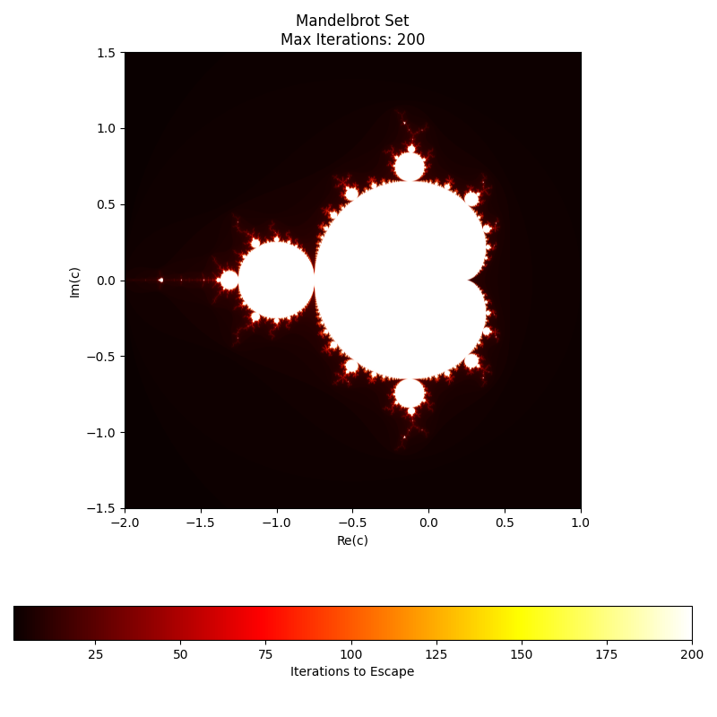
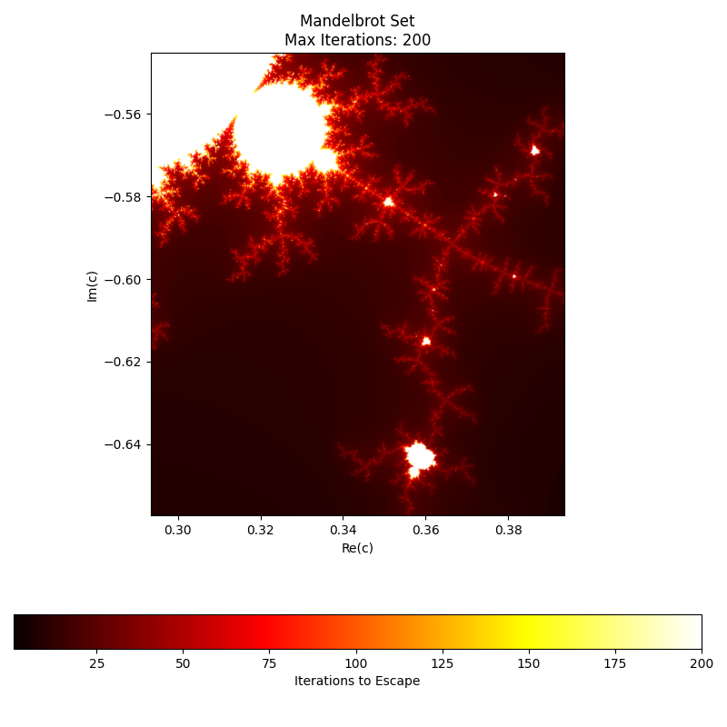

# Mandelbrot Set

## Pixel-Based Rendering of Mandelbrot Set

### Overview

The Mandelbrot set is named after the French-American mathematician Benoît B. Mandelbrot, who is famous for his visualizations of the set in 1980. However, the mathematical foundations of the set were developed earlier by Pierre Fatou and Gastón Julia, who studied the dynamics of iterative functions in the complex plane in the early 20th century. Their pioneering work laid the groundwork for understanding the behavior of such sets.
The set itself was detected in the 1970s by Robert Brooks and Julius Matelski while exploring complex dynamics. It was Mandelbrot's insight and groundbreaking visualizations that popularized the set and revealed its deep connection to fractal geometry, making it an iconic object in both mathematics and art.

### Definition

The Mandelbrot set is a set of complex numbers defined by a simple iterative equation.  

For each complex number c the sequence is defined as:

$$
\large
z_{n+1} = z_n^2 + c
\large  
$$
where
$$
\large z_0=0 \large
$$

If the sequence $$z_n$$ remains within a certain range and does not tend toward infinity, the complex number c belongs to the Mandelbrot set. If at any step the magnitude $$∣z_n∣$$ becomes greater than 2, the sequence will eventually grow infinitely large, meaning c is not part of the set.

Coloring Scheme: Points that escape to infinity (i.e., their magnitude exceeds 2) are colored based on how many iterations it took to escape.  

The Mandelbrot set is famous for its highly detailed and self-repeating boundary structure. When zooming in, the complexity never stops revealing new patterns, making it a classic example of fractal geometry.
