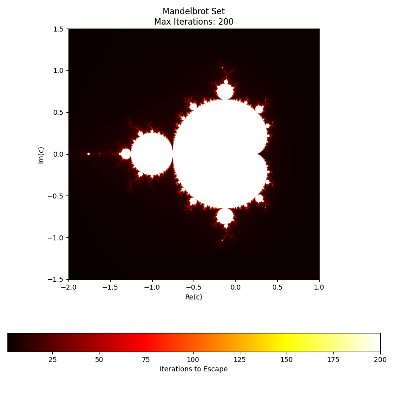
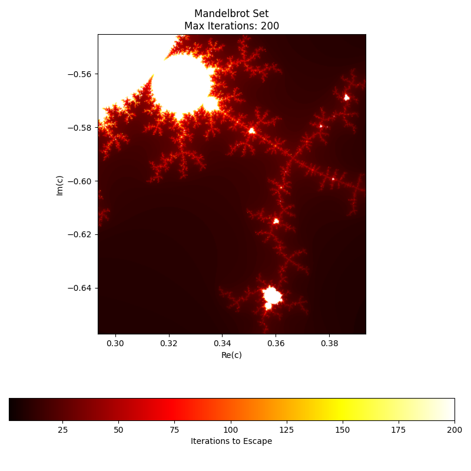

# Mandelbrot Set

## Pixel-Based Rendering of Mandelbrot Set

The Mandelbrot set is named after the French-American mathematician Benoît B. Mandelbrot, who is famous for his visualizations of the set in 1980. However, the mathematical foundations of the set were developed earlier by Pierre Fatou and Gastón Julia, who studied the dynamics of iterative functions in the complex plane in the early 20th century. Their pioneering work laid the groundwork for understanding the behavior of such sets.
The set itself was detected in the 1970s by Robert Brooks and Julius Matelski while exploring complex dynamics. It was Mandelbrot's insight and groundbreaking visualizations that popularized the set and revealed its deep connection to fractal geometry, making it an iconic object in both mathematics and art.
Overview
The Mandelbrot set is a set of complex numbers defined by a simple iterative equation. For each complex number c  

the sequence is defined as:  

z_{n+1} = z_n^2 + c
​
If the sequence remains bounded (i.e., it doesn't grow infinitely large) as the iterations progress, thenc is part of the Mandelbrot set.
The set is famous for its intricate, self-similar boundary structure, which reveals infinite detail upon zooming in, exhibiting an example of fractal geometry. The boundary of the Mandelbrot set is a highly complex and infinitely intricate shape that has fascinated mathematicians and artists alike.
